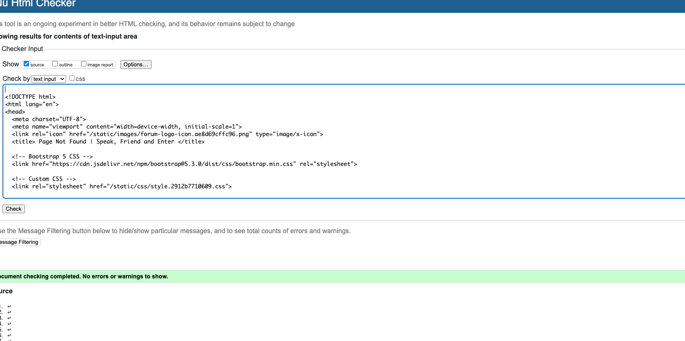
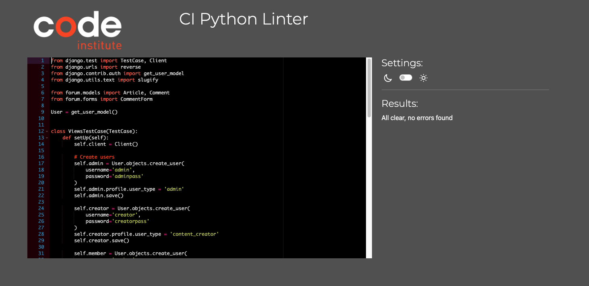
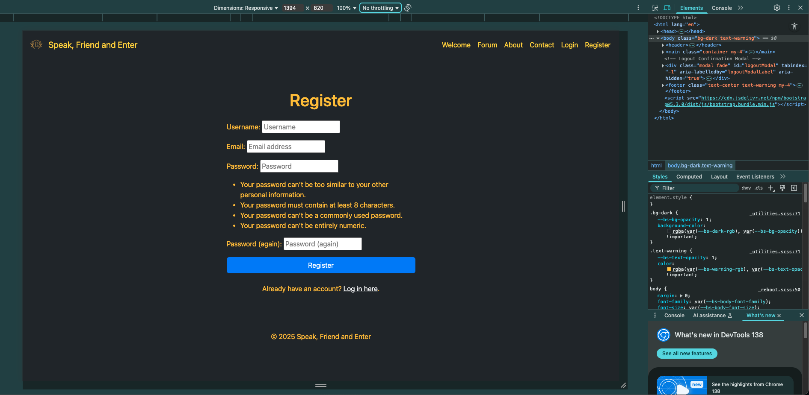
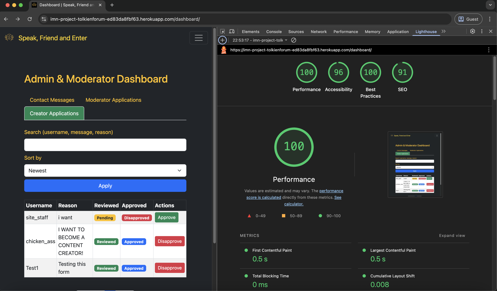

# Testing

> [!NOTE]
> Return back to the [README.md](README.md) file.

## Code Validation

### HTML

I have used the recommended [HTML W3C Validator](https://validator.w3.org) to validate all of my HTML files.

| Directory | File | URL | Screenshot | Notes |
| --- | --- | --- | --- | --- |
| forum | [about.html](https://github.com/Ironmonkeynuts/tolkien_forum/blob/main/forum/templates/forum/about.html) | Link (if applicable) |  | Notes (if applicable) |
| forum | [article_detail.html](https://github.com/Ironmonkeynuts/tolkien_forum/blob/main/forum/templates/forum/article_detail.html) | Link (if applicable) |  | Notes (if applicable) |
| forum | [article_form.html](https://github.com/Ironmonkeynuts/tolkien_forum/blob/main/forum/templates/forum/article_form.html) | Link (if applicable) |  | Notes (if applicable) |
| forum | [contact.html](https://github.com/Ironmonkeynuts/tolkien_forum/blob/main/forum/templates/forum/contact.html) | Link (if applicable) |  | Notes (if applicable) |
| forum | [dashboard.html](https://github.com/Ironmonkeynuts/tolkien_forum/blob/main/forum/templates/forum/dashboard.html) | Link (if applicable) |  | Notes (if applicable) |
| forum | [edit_profile.html](https://github.com/Ironmonkeynuts/tolkien_forum/blob/main/forum/templates/forum/edit_profile.html) | Link (if applicable) |  | Notes (if applicable) |
| forum | [forum.html](https://github.com/Ironmonkeynuts/tolkien_forum/blob/main/forum/templates/forum/forum.html) | Link (if applicable) |  | Notes (if applicable) |
| forum | [profile.html](https://github.com/Ironmonkeynuts/tolkien_forum/blob/main/forum/templates/forum/profile.html) | Link (if applicable) |  | Notes (if applicable) |
| forum | [profile_list.html](https://github.com/Ironmonkeynuts/tolkien_forum/blob/main/forum/templates/forum/profile_list.html) | Link (if applicable) |  | Notes (if applicable) |
| forum | [welcome.html](https://github.com/Ironmonkeynuts/tolkien_forum/blob/main/forum/templates/forum/welcome.html) | Link (if applicable) |  | Notes (if applicable) |
| templates | [404.html](https://github.com/Ironmonkeynuts/tolkien_forum/blob/main/templates/404.html) | Link (if applicable) |  | Validated by input |

### CSS

I have used the recommended [CSS Jigsaw Validator](https://jigsaw.w3.org/css-validator) to validate all of my CSS files.

| Directory | File | URL | Screenshot | Notes |
| --- | --- | --- | --- | --- |
| static | [style.css](https://github.com/Ironmonkeynuts/tolkien_forum/blob/main/static/css/style.css) | https://jigsaw.w3.org/css-validator/validator?lang=en&profile=css3svg&uri=https%3A%2F%2Fimn-project-tolkienforum-ed83da8fbf63.herokuapp.com%2F&usermedium=all&vextwarning=&warning=1 |  | Notes (if applicable) |

### JavaScript

No JavaScript code

### Python

I have used the recommended [PEP8 CI Python Linter](https://pep8ci.herokuapp.com) to validate all of my Python files.

| Directory | File | URL | Screenshot | Notes |
| --- | --- | --- | --- | --- |
| forum | [admin.py](https://github.com/Ironmonkeynuts/tolkien_forum/blob/main/forum/admin.py) | [PEP8 CI Link](https://pep8ci.herokuapp.com/https://raw.githubusercontent.com/Ironmonkeynuts/tolkien_forum/main/forum/admin.py) |  | Notes (if applicable) |
| forum | [forms.py](https://github.com/Ironmonkeynuts/tolkien_forum/blob/main/forum/forms.py) | [PEP8 CI Link](https://pep8ci.herokuapp.com/https://raw.githubusercontent.com/Ironmonkeynuts/tolkien_forum/main/forum/forms.py) |  | Notes (if applicable) |
| forum | [models.py](https://github.com/Ironmonkeynuts/tolkien_forum/blob/main/forum/models.py) | [PEP8 CI Link](https://pep8ci.herokuapp.com/https://raw.githubusercontent.com/Ironmonkeynuts/tolkien_forum/main/forum/models.py) |  | Notes (if applicable) |
| forum | [signals.py](https://github.com/Ironmonkeynuts/tolkien_forum/blob/main/forum/signals.py) | [PEP8 CI Link](https://pep8ci.herokuapp.com/https://raw.githubusercontent.com/Ironmonkeynuts/tolkien_forum/main/forum/signals.py) |  | Notes (if applicable) |
| forum | [forum_extras.py](https://github.com/Ironmonkeynuts/tolkien_forum/blob/main/forum/templatetags/forum_extras.py) | [PEP8 CI Link](https://pep8ci.herokuapp.com/https://raw.githubusercontent.com/Ironmonkeynuts/tolkien_forum/main/forum/templatetags/forum_extras.py) |  | Notes (if applicable) |
| forum | [tests.py](https://github.com/Ironmonkeynuts/tolkien_forum/blob/main/forum/tests.py) | [PEP8 CI Link](https://pep8ci.herokuapp.com/https://raw.githubusercontent.com/Ironmonkeynuts/tolkien_forum/main/forum/tests.py) |  | Notes (if applicable) |
| forum | [urls.py](https://github.com/Ironmonkeynuts/tolkien_forum/blob/main/forum/urls.py) | [PEP8 CI Link](https://pep8ci.herokuapp.com/https://raw.githubusercontent.com/Ironmonkeynuts/tolkien_forum/main/forum/urls.py) |  | Notes (if applicable) |
| forum | [views.py](https://github.com/Ironmonkeynuts/tolkien_forum/blob/main/forum/views.py) | [PEP8 CI Link](https://pep8ci.herokuapp.com/https://raw.githubusercontent.com/Ironmonkeynuts/tolkien_forum/main/forum/views.py) |  | Notes (if applicable) |
|  | [manage.py](https://github.com/Ironmonkeynuts/tolkien_forum/blob/main/manage.py) | [PEP8 CI Link](https://pep8ci.herokuapp.com/https://raw.githubusercontent.com/Ironmonkeynuts/tolkien_forum/main/manage.py) |  | Notes (if applicable) |
| tolkienforum | [settings.py](https://github.com/Ironmonkeynuts/tolkien_forum/blob/main/tolkienforum/settings.py) | [PEP8 CI Link](https://pep8ci.herokuapp.com/https://raw.githubusercontent.com/Ironmonkeynuts/tolkien_forum/main/tolkienforum/settings.py) |  | Notes (if applicable) |
| tolkienforum | [urls.py](https://github.com/Ironmonkeynuts/tolkien_forum/blob/main/tolkienforum/urls.py) | [PEP8 CI Link](https://pep8ci.herokuapp.com/https://raw.githubusercontent.com/Ironmonkeynuts/tolkien_forum/main/tolkienforum/urls.py) |  | Notes (if applicable) |

## Responsiveness

I've tested my deployed project to check for responsiveness issues.

| Page | Mobile | Tablet | Desktop | Notes |
| --- | --- | --- | --- | --- |
| Register |  |  |  | Works as expected |
| Login |  |  |  | Works as expected |
| Welcome |  |  |  | Works as expected |
| Forum |  |  |  | Works as expected |
| Article |  |  |  | Works as expected |
| Add/Edit Article |  |  |  | Works as expected |
| Profile |  |  |  | Works as expected |
| Community |  |  |  | Works as expected |
| Contact |  |  |  | Works as expected |
| Dashboard |  |  |  | Works as expected |
| 404 |  |  |  | Works as expected |

## Browser Compatibility

I've tested my deployed project on multiple browsers to check for compatibility issues.

| Page | Chrome | Edge | Safari | Notes |
| --- | --- | --- | --- | --- |
| Register |  |  |  | Works as expected |
| Login |  |  |  | Works as expected |
| Welcome |  |  |  | Works as expected |
| Forum |  |  |  | Works as expected |
| Article |  |  |  | Works as expected |
| Add/Edit Article |  |  |  | Works as expected |
| Profile |  |  |  | Works as expected |
| Community |  |  |  | Works as expected |
| Contact |  |  |  | Works as expected |
| Dashboard |  |  |  | Works as expected |
| 404 |  |  |  | Works as expected |

## Lighthouse Audit

⚠️ INSTRUCTIONS ⚠️

Use this space to discuss testing the live/deployed site's Lighthouse Audit reports. Avoid testing the local version (Gitpod/VSCode/etc.), as this can have knock-on effects for performance. If you don't have "Lighthouse" in your Developer Tools, it can be added as an [extension](https://chrome.google.com/webstore/detail/lighthouse/blipmdconlkpinefehnmjammfjpmpbjk).

Unless your project is a single-page application (SPA), you should test Lighthouse Audit results for all of your pages, for both *mobile* and *desktop*.

**IMPORTANT**: You must provide screenshots of the results, to "prove" that you've actually tested them.

⚠️ --- END --- ⚠️

I've tested my deployed project using the Lighthouse Audit tool to check for any major issues. Some warnings are outside of my control, and mobile results tend to be lower than desktop.

| Page | Mobile | Desktop |
| --- | --- | --- |
| Register |  |  |
| Login |  |  |
| Welcome |  |  |
| Forum |  |  |
| Article |  |  |
| Add/Edit Article |  |  |
| Profile |  |  |
| Community |  |  |
| Contact |  |  |
| Dashboard |  |  |
| 404 |  |  |

## Defensive Programming

⚠️ INSTRUCTIONS ⚠️

Defensive programming (defensive design) is extremely important! When building projects that accept user inputs or forms, you should always test the level of security for each form field. Examples of this could include (but not limited to):

All Projects:

- Users cannot submit an empty form (add the `required` attribute)
- Users must enter valid field types (ensure the correct input `type=""` is used)
- Users cannot brute-force a URL to navigate to a restricted pages

Python Projects:

- Users cannot perform CRUD functionality if not authenticated (if login functionality exists)
- User-A should not be able to manipulate data belonging to User-B, or vice versa
- Non-Authenticated users should not be able to access pages that require authentication
- Standard users should not be able to access pages intended for superusers/admins

You'll want to test all functionality on your application, whether it's a standard form, or CRUD functionality, for data manipulation on a database. Try to access various pages on your site as different user types (User-A, User-B, guest user, admin, superuser). You should include any manual tests performed, and the expected results/outcome.

Testing should be replicable (can someone else replicate the same outcome?). Ideally, tests cases should focus on each individual section of every page on the website. Each test case should be specific, objective, and step-wise replicable.

Instead of adding a general overview saying that everything works fine, consider documenting tests on each element of the page (eg. button clicks, input box validation, navigation links, etc.) by testing them in their "happy flow", their "bad/exception flow", mentioning the expected and observed results, and drawing a parallel between them where applicable.

Consider using the following format for manual test cases:

- Expected Outcome / Test Performed / Result Received / Fixes Implemented

- **Expected**: "Feature is expected to do X when the user does Y."
- **Testing**: "Tested the feature by doing Y."
- (either) **Result**: "The feature behaved as expected, and it did Y."
- (or) **Result**: "The feature did not respond to A, B, or C."
- **Fix**: "I did Z to the code because something was missing."

Use the table below as a basic start, and expand on it using the logic above.

⚠️ --- END --- ⚠️

Defensive programming was manually tested with the below user acceptance testing:

| Page | Expectation | Test | Result | Screenshot |
| --- | --- | --- | --- | --- |
| Blog Management | Feature is expected to allow the blog owner to create new posts with a title, featured image, and content. | Created a new post with valid title, image, and content data. | Post was created successfully and displayed correctly in the blog. |  |
| | Feature is expected to allow the blog owner to update existing posts. | Edited the content of an existing blog post. | Post was updated successfully with the new content. |  |
| | Feature is expected to allow the blog owner to delete blog posts. | Attempted to delete a blog post, confirming the action before proceeding. | Blog post was deleted successfully. |  |
| | Feature is expected to retrieve a list of all published posts. | Accessed the blog owner dashboard to view all published posts. | All published posts were displayed in a list view. |  |
| | Feature is expected to preview posts as drafts before publishing. | Created a draft post and previewed it. | Draft was displayed correctly in preview mode. |  |
| Comments Management | Feature is expected to allow the blog owner to approve or reject comments. | Approved and rejected comments from the dashboard. | Approved comments were published; rejected comments were removed. |  |
| | Feature is expected to allow the blog owner to edit or delete comments. | Edited and deleted existing comments. | Comments were updated or removed successfully. |  |
| User Authentication | Feature is expected to allow registered users to log in to the site. | Attempted to log in with valid and invalid credentials. | Login was successful with valid credentials; invalid credentials were rejected. |  |
| | Feature is expected to allow users to register for an account. | Registered a new user with unique credentials. | User account was created successfully. |  |
| | Feature is expected to allow users to log out securely. | Logged out and tried accessing a restricted page. | Access was denied after logout, as expected. |  |
| User Comments | Feature is expected to allow registered users to leave comments on blog posts. | Logged in and added comments to a blog post. | Comments were successfully added and marked as pending approval. |  |
| | Feature is expected to display a notification that comments are pending approval. | Added a comment and checked the notification message. | Notification was displayed as expected. |  |
| | Feature is expected to allow users to edit their own comments. | Edited personal comments. | Comments were updated as expected. |  |
| | Feature is expected to allow users to delete their own comments. | Deleted personal comments. | Comments were removed as expected. |  |
| Guest Features | Feature is expected to allow guest users to read blog posts without registering. | Opened blog posts as a guest user. | Blog posts were fully accessible without logging in. |  |
| | Feature is expected to display the names of other commenters on posts. | Checked the names of commenters on posts as a guest user. | Commenter names were displayed as expected. |  |
| | Feature is expected to block standard users from brute-forcing admin pages. | Attempted to navigate to admin-only pages by manipulating the URL (e.g., `/admin`). | Access was blocked, and a message was displayed showing denied access. |  |
| 404 Error Page | Feature is expected to display a 404 error page for non-existent pages. | Navigated to an invalid URL (e.g., `/test`). | A custom 404 error page was displayed as expected. |  |

## User Story Testing

⚠️ INSTRUCTIONS ⚠️

Testing User Stories is actually quite simple, once you've already got the stories defined on your README.

Most of your project's **Features** should already align with the **User Stories**, so this should be as simple as creating a table with the User Story, matching with the re-used screenshot from the respective Feature.

⚠️ --- END --- ⚠️

| Target | Expectation | Outcome | Screenshot |
| --- | --- | --- | --- |
| As a content creator | I would like to create new forum articles with a title, featured image, and content | so that I can share my experiences with my audience. |  |
| As a content creator | I would like to update my existing forum articles | so that I can correct or add new information to my previous stories. |  |
| As a content creator | I would like to delete my forum articles | so that I can remove outdated or irrelevant content from the forum. |  |
| As a content creator | I would like to retrieve a list of all my published forum articles | so that I can manage them from a central dashboard. |  |
| As a content creator | I would like to preview a article as draft before publishing it | so that I can ensure formatting and content appear correctly. |  |
| As a moderator or admin | I would like to review comments before they are published | so that I can filter out spam or inappropriate content. |  |
| As a moderator or admin | I would like to approve or disapprove content from users | so that I can maintain control over the discussion on the forum. |  |
| As a content creator | I would like to view a list of all comments (both approved and pending) | so that I can manage user engagement effectively. |  |
| As an admin | I would like to edit or delete user content | so that I can clean up or remove inappropriate responses after they've been posted. |  |
| As a registered user | I would like to log in to the site | so that I can leave comments on forum articles. |   |
| As a registered user | I would like to register for an account | so that I can become part of the community and engage with the forum. |   |
| As a registered user | I would like to leave a comment on a forum article | so that I can share my thoughts or ask questions about the owner's experiences. |   |
| As a registered user | I would like my comment to show my name and the timestamp | so that others can see who I am and when I left the comment. |   |
| As a registered user | I would like to receive a notification or message saying my comment is pending approval | so that I understand it hasn't been posted immediately. |   |
| As a registered user | I would like to edit or delete my own comments | so that I can fix mistakes or retract my statement. |
| As a guest user | I would like to read forum articles without registering | so that I can enjoy the content without needing to log in. |   |
| As a guest user | I would like to browse past articles | so that I can explore the forum's full content history. |   |
| As a guest user | I would like to register for an account | so that I can participate in the community by leaving comments on articles. |   |
| As a guest user | I would like to see the names of other commenters on articles | so that I can get a sense of community interaction before registering. |   |
| As a user | I would like to see a 404 error page if I get lost | so that it's obvious that I've stumbled upon a page that doesn't exist. |   |

## Automated Testing

I have conducted a series of automated tests on my application.

> [!NOTE]
> I fully acknowledge and understand that, in a real-world scenario, an extensive set of additional tests would be more comprehensive.

### Python (Unit Testing)

⚠️ INSTRUCTIONS ⚠️

Adjust the code below (file names, function names, etc.) to match your own project files/folders. Use these notes loosely when documenting your own Python Unit tests, and remove/adjust where applicable.

⚠️ SAMPLE ⚠️

I have used Django's built-in unit testing framework to test the application functionality. In order to run the tests, I ran the following command in the terminal each time:

- `python3 manage.py test name-of-app`

To create the coverage report, I would then run the following commands:

- `pip3 install coverage`
- `pip3 freeze --local > requirements.txt`
- `coverage run --omit=*/site-packages/*,*/migrations/*,*/__init__.py,env.py,.env manage.py test`
- `coverage report`

To see the HTML version of the reports, and find out whether some pieces of code were missing, I ran the following commands:

- `coverage html`
- `python3 -m http.server`

Below are the results from the full coverage report on my application that I've tested:

#### Unit Test Issues

⚠️ INSTRUCTIONS ⚠️

Use this section to list any known issues you ran into while writing your Python unit tests. Remember to include screenshots (where possible), and a solution to the issue (if known). This can be used for both "fixed" and "unresolved" issues. Remove this sub-section entirely if you somehow didn't run into any issues while working with your tests.

⚠️ --- END --- ⚠️

## Bugs

⚠️ INSTRUCTIONS ⚠️

Nobody likes bugs,... except the assessors! Projects seem more suspicious if a student doesn't properly track their bugs. If you're about to submit your project without any bugs listed below, you should ask yourself why you're doing this course in the first place, if you're able to build this entire application without running into any bugs. The best thing you can do for any project is to document your bugs! Not only does it show the true stages of development, but think of it as breadcrumbs for yourself in the future, should you encounter the same/similar bug again, it acts as a gentle reminder on what you did to fix the bug.

If/when you encounter bugs during the development stages of your project, you should document them here, ideally with a screenshot explaining what the issue was, and what you did to fix the bug.

Alternatively, an improved way to manage bugs is to use the built-in **[Issues](https://www.github.com/Ironmonkeynuts/tolkien_forum/issues)** tracker on your GitHub repository. This can be found at the top of your repository, the tab called "Issues".

If using the Issues tracker for bug management, you can simplify the documentation process for testing. Issues allow you to directly paste screenshots into the issue page without having to first save the screenshot locally. You can add labels to your issues (e.g. `bug`), assign yourself as the owner, and add comments/updates as you progress with fixing the issue(s). Once you've solved the issue/bug, you should then "Close" it.

When showcasing your bug tracking for assessment, you can use the following examples below.

⚠️ --- END --- ⚠️

### Fixed Bugs

I've used [GitHub Issues](https://www.github.com/Ironmonkeynuts/tolkien_forum/issues) to track and manage bugs and issues during the development stages of my project.

All previously closed/fixed bugs can be tracked [here](https://www.github.com/Ironmonkeynuts/tolkien_forum/issues?q=is%3Aissue+is%3Aclosed+label%3Abug).

### Unfixed Bugs

⚠️ INSTRUCTIONS ⚠️

You will need to mention any unfixed bugs and why they are not fixed upon submission of your project. This section should include shortcomings of the frameworks or technologies used. Although time can be a big variable to consider, paucity of time and difficulty understanding implementation is not a valid reason to leave bugs unfixed. Where possible, you must fix all outstanding bugs, unless outside of your control.

If you've identified any unfixed bugs, no matter how small, be sure to list them here! It's better to be honest and list them, because if it's not documented and an assessor finds the issue, they need to know whether or not you're aware of them as well, and why you've not corrected/fixed them.

⚠️ --- END --- ⚠️

Any remaining open issues can be tracked [here](https://www.github.com/Ironmonkeynuts/tolkien_forum/issues).

### Known Issues

| Issue | Screenshot |
| --- | --- |
| On devices smaller than 375px, the page starts to have horizontal `overflow-x` scrolling. |  |
| When validating HTML with a semantic `<section>` element, the validator warns about lacking a header `h2-h6`. This is acceptable. |  |
| Validation errors on "signup.html" coming from the Django Allauth package. |  |

> [!IMPORTANT]
> There are no remaining bugs that I am aware of, though, even after thorough testing, I cannot rule out the possibility.

