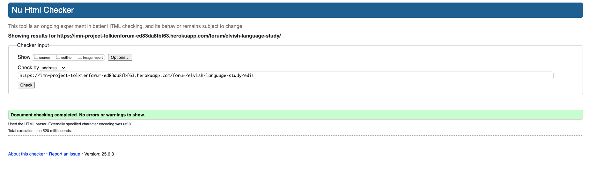
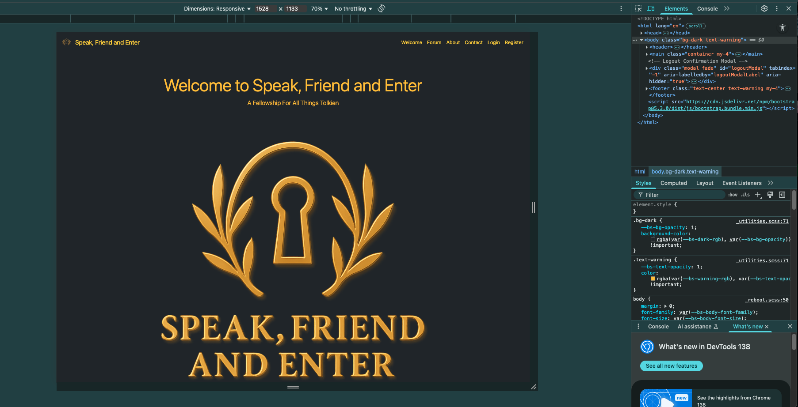
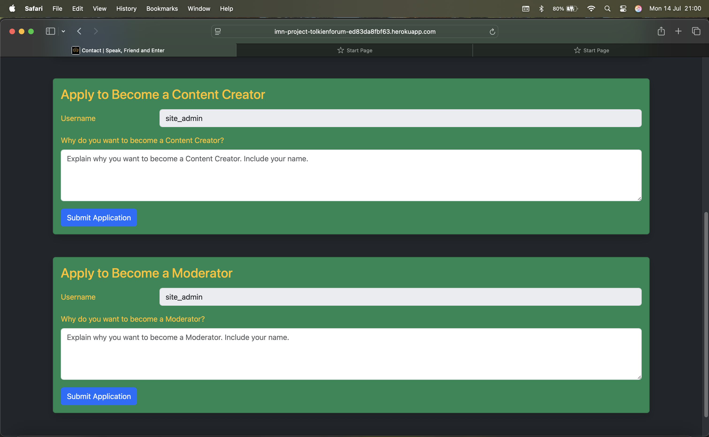
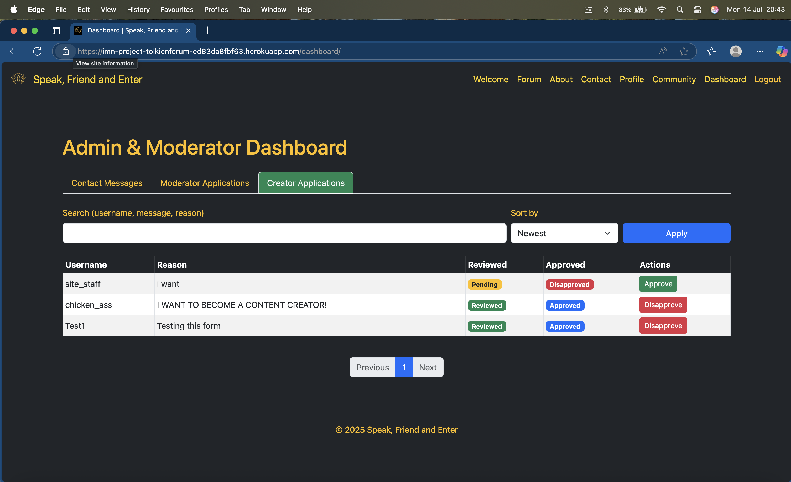
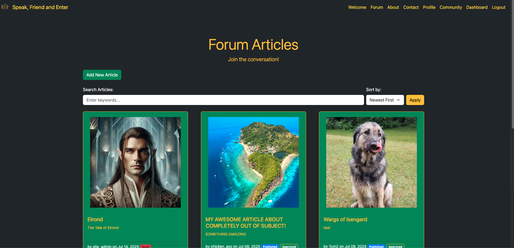
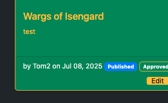
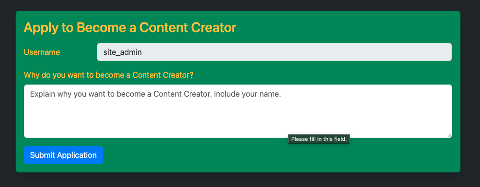
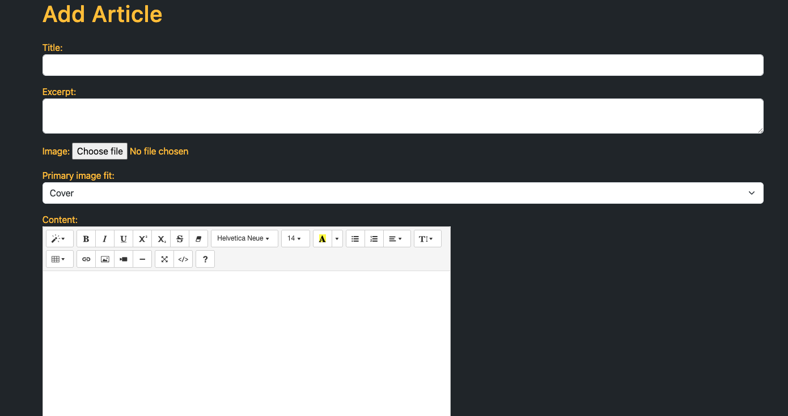
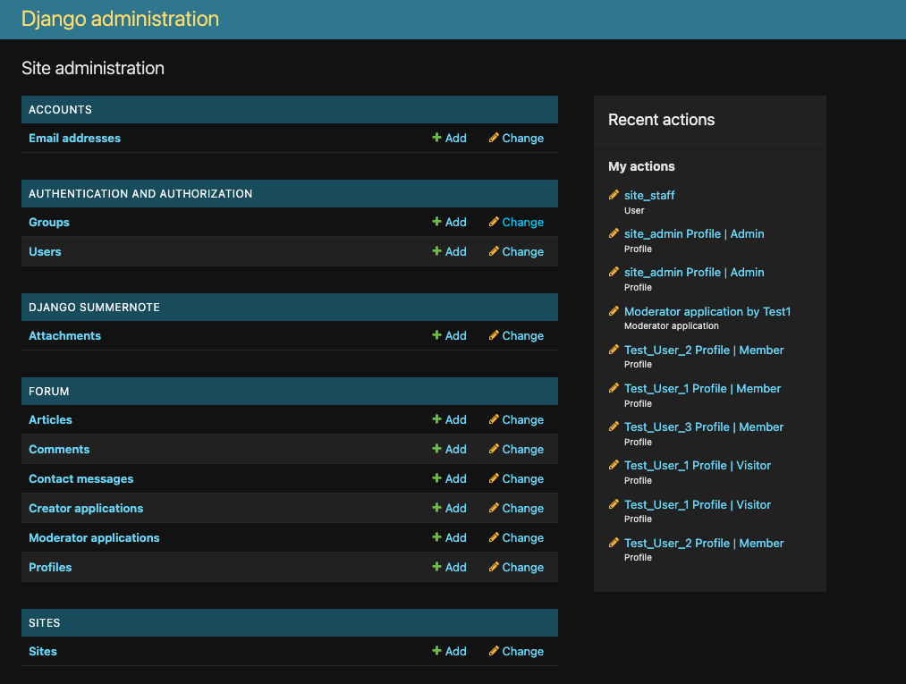
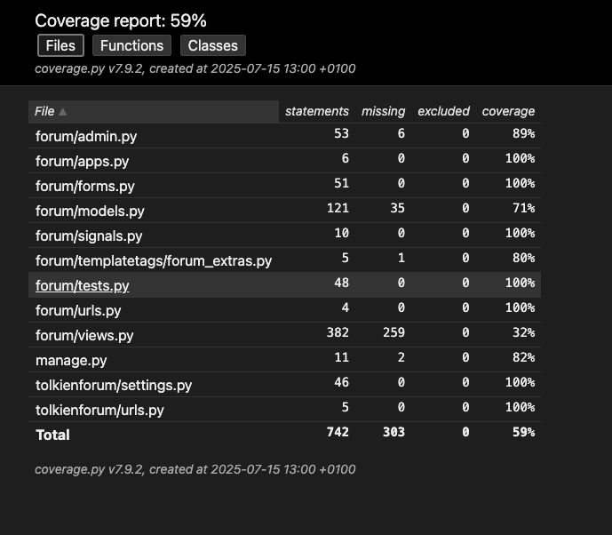

# Testing

> [!NOTE]
> Return back to the [README.md](README.md) file.

## Code Validation

### HTML

I have used the recommended [HTML W3C Validator](https://validator.w3.org) to validate all of my HTML files.

| Directory | File | URL | Screenshot | Notes |
| --- | --- | --- | --- | --- |
| forum | [about.html](https://github.com/Ironmonkeynuts/tolkien_forum/blob/main/forum/templates/forum/about.html) | Link (if applicable) |  | Notes (if applicable) |
| forum | [article_detail.html](https://github.com/Ironmonkeynuts/tolkien_forum/blob/main/forum/templates/forum/article_detail.html) | Link (if applicable) |  | Notes (if applicable) |
| forum | [article_form.html](https://github.com/Ironmonkeynuts/tolkien_forum/blob/main/forum/templates/forum/article_form.html) | Link (if applicable) |  | Notes (if applicable) |
| forum | [contact.html](https://github.com/Ironmonkeynuts/tolkien_forum/blob/main/forum/templates/forum/contact.html) | Link (if applicable) |  | Notes (if applicable) |
| forum | [dashboard.html](https://github.com/Ironmonkeynuts/tolkien_forum/blob/main/forum/templates/forum/dashboard.html) | Link (if applicable) |  | Notes (if applicable) |
| forum | [edit_profile.html](https://github.com/Ironmonkeynuts/tolkien_forum/blob/main/forum/templates/forum/edit_profile.html) | Link (if applicable) |  | Notes (if applicable) |
| forum | [forum.html](https://github.com/Ironmonkeynuts/tolkien_forum/blob/main/forum/templates/forum/forum.html) | Link (if applicable) |  | Notes (if applicable) |
| forum | [profile.html](https://github.com/Ironmonkeynuts/tolkien_forum/blob/main/forum/templates/forum/profile.html) | Link (if applicable) |  | Notes (if applicable) |
| forum | [profile_list.html](https://github.com/Ironmonkeynuts/tolkien_forum/blob/main/forum/templates/forum/profile_list.html) | Link (if applicable) |  | Notes (if applicable) |
| forum | [welcome.html](https://github.com/Ironmonkeynuts/tolkien_forum/blob/main/forum/templates/forum/welcome.html) | Link (if applicable) |  | Notes (if applicable) |
| templates | [404.html](https://github.com/Ironmonkeynuts/tolkien_forum/blob/main/templates/404.html) | Link (if applicable) |  | Validated by input |

### CSS

I have used the recommended [CSS Jigsaw Validator](https://jigsaw.w3.org/css-validator) to validate all of my CSS files.

| Directory | File | URL | Screenshot | Notes |
| --- | --- | --- | --- | --- |
| static | [style.css](https://github.com/Ironmonkeynuts/tolkien_forum/blob/main/static/css/style.css) | https://jigsaw.w3.org/css-validator/validator?lang=en&profile=css3svg&uri=https%3A%2F%2Fimn-project-tolkienforum-ed83da8fbf63.herokuapp.com%2F&usermedium=all&vextwarning=&warning=1 |  | Notes (if applicable) |

### JavaScript

No JavaScript code

### Python

I have used the recommended [PEP8 CI Python Linter](https://pep8ci.herokuapp.com) to validate all of my Python files.

| Directory | File | URL | Screenshot | Notes |
| --- | --- | --- | --- | --- |
| forum | [admin.py](https://github.com/Ironmonkeynuts/tolkien_forum/blob/main/forum/admin.py) | [PEP8 CI Link](https://pep8ci.herokuapp.com/https://raw.githubusercontent.com/Ironmonkeynuts/tolkien_forum/main/forum/admin.py) |  | Notes (if applicable) |
| forum | [forms.py](https://github.com/Ironmonkeynuts/tolkien_forum/blob/main/forum/forms.py) | [PEP8 CI Link](https://pep8ci.herokuapp.com/https://raw.githubusercontent.com/Ironmonkeynuts/tolkien_forum/main/forum/forms.py) |  | Notes (if applicable) |
| forum | [models.py](https://github.com/Ironmonkeynuts/tolkien_forum/blob/main/forum/models.py) | [PEP8 CI Link](https://pep8ci.herokuapp.com/https://raw.githubusercontent.com/Ironmonkeynuts/tolkien_forum/main/forum/models.py) |  | Notes (if applicable) |
| forum | [signals.py](https://github.com/Ironmonkeynuts/tolkien_forum/blob/main/forum/signals.py) | [PEP8 CI Link](https://pep8ci.herokuapp.com/https://raw.githubusercontent.com/Ironmonkeynuts/tolkien_forum/main/forum/signals.py) |  | Notes (if applicable) |
| forum | [forum_extras.py](https://github.com/Ironmonkeynuts/tolkien_forum/blob/main/forum/templatetags/forum_extras.py) | [PEP8 CI Link](https://pep8ci.herokuapp.com/https://raw.githubusercontent.com/Ironmonkeynuts/tolkien_forum/main/forum/templatetags/forum_extras.py) |  | Notes (if applicable) |
| forum | [tests.py](https://github.com/Ironmonkeynuts/tolkien_forum/blob/main/forum/tests.py) | [PEP8 CI Link](https://pep8ci.herokuapp.com/https://raw.githubusercontent.com/Ironmonkeynuts/tolkien_forum/main/forum/tests.py) |  | Notes (if applicable) |
| forum | [urls.py](https://github.com/Ironmonkeynuts/tolkien_forum/blob/main/forum/urls.py) | [PEP8 CI Link](https://pep8ci.herokuapp.com/https://raw.githubusercontent.com/Ironmonkeynuts/tolkien_forum/main/forum/urls.py) |  | Notes (if applicable) |
| forum | [views.py](https://github.com/Ironmonkeynuts/tolkien_forum/blob/main/forum/views.py) | [PEP8 CI Link](https://pep8ci.herokuapp.com/https://raw.githubusercontent.com/Ironmonkeynuts/tolkien_forum/main/forum/views.py) |  | Notes (if applicable) |
|  | [manage.py](https://github.com/Ironmonkeynuts/tolkien_forum/blob/main/manage.py) | [PEP8 CI Link](https://pep8ci.herokuapp.com/https://raw.githubusercontent.com/Ironmonkeynuts/tolkien_forum/main/manage.py) |  | Notes (if applicable) |
| tolkienforum | [settings.py](https://github.com/Ironmonkeynuts/tolkien_forum/blob/main/tolkienforum/settings.py) | [PEP8 CI Link](https://pep8ci.herokuapp.com/https://raw.githubusercontent.com/Ironmonkeynuts/tolkien_forum/main/tolkienforum/settings.py) |  | Notes (if applicable) |
| tolkienforum | [urls.py](https://github.com/Ironmonkeynuts/tolkien_forum/blob/main/tolkienforum/urls.py) | [PEP8 CI Link](https://pep8ci.herokuapp.com/https://raw.githubusercontent.com/Ironmonkeynuts/tolkien_forum/main/tolkienforum/urls.py) |  | Notes (if applicable) |

## Responsiveness

I've tested my deployed project to check for responsiveness issues.

| Page | Mobile | Tablet | Desktop | Notes |
| --- | --- | --- | --- | --- |
| Register |  |  |  | Works as expected |
| Login |  |  |  | Works as expected |
| Welcome |  |  |  | Works as expected |
| Forum |  |  |  | Works as expected |
| Article |  |  |  | Works as expected |
| Add/Edit Article |  |  |  | Works as expected |
| Profile |  |  |  | Works as expected |
| Community |  |  |  | Works as expected |
| Contact |  |  |  | Works as expected |
| Dashboard |  |  |  | Works as expected |
| 404 |  |  |  | Works as expected |

## Browser Compatibility

I've tested my deployed project on multiple browsers to check for compatibility issues.

| Page | Chrome | Edge | Safari | Notes |
| --- | --- | --- | --- | --- |
| Register |  |  |  | Works as expected |
| Login |  |  |  | Works as expected |
| Welcome |  |  |  | Works as expected |
| Forum |  |  |  | Works as expected |
| Article |  |  |  | Works as expected |
| Add/Edit Article |  |  |  | Works as expected |
| Profile |  |  |  | Works as expected |
| Community |  |  |  | Works as expected |
| Contact |  |  |  | Works as expected |
| Dashboard |  |  |  | Works as expected |
| 404 |  |  |  | Works as expected |

## Lighthouse Audit

I've tested my deployed project using the Lighthouse Audit tool to check for any major issues. Some warnings are outside of my control, and mobile results tend to be lower than desktop.

| Page | Mobile | Desktop |
| --- | --- | --- |
| Register |  |  |
| Login |  |  |
| Welcome |  |  |
| Forum |  |  |
| Article |  |  |
| Add/Edit Article |  |  |
| Profile |  |  |
| Community |  |  |
| Contact |  |  |
| Dashboard |  |  |
| 404 |  |  |

## Defensive Programming

⚠️ INSTRUCTIONS ⚠️

Defensive programming (defensive design) is extremely important! When building projects that accept user inputs or forms, you should always test the level of security for each form field. Examples of this could include (but not limited to):

All Projects:

- Users cannot submit an empty form (add the `required` attribute)
- Users must enter valid field types (ensure the correct input `type=""` is used)
- Users cannot brute-force a URL to navigate to a restricted pages

Python Projects:

- Users cannot perform CRUD functionality if not authenticated (if login functionality exists)
- User-A should not be able to manipulate data belonging to User-B, or vice versa
- Non-Authenticated users should not be able to access pages that require authentication
- Standard users should not be able to access pages intended for superusers/admins

You'll want to test all functionality on your application, whether it's a standard form, or CRUD functionality, for data manipulation on a database. Try to access various pages on your site as different user types (User-A, User-B, guest user, admin, superuser). You should include any manual tests performed, and the expected results/outcome.

Testing should be replicable (can someone else replicate the same outcome?). Ideally, tests cases should focus on each individual section of every page on the website. Each test case should be specific, objective, and step-wise replicable.

Instead of adding a general overview saying that everything works fine, consider documenting tests on each element of the page (eg. button clicks, input box validation, navigation links, etc.) by testing them in their "happy flow", their "bad/exception flow", mentioning the expected and observed results, and drawing a parallel between them where applicable.

Consider using the following format for manual test cases:

- Expected Outcome / Test Performed / Result Received / Fixes Implemented

- **Expected**: "Feature is expected to do X when the user does Y."
- **Testing**: "Tested the feature by doing Y."
- (either) **Result**: "The feature behaved as expected, and it did Y."
- (or) **Result**: "The feature did not respond to A, B, or C."
- **Fix**: "I did Z to the code because something was missing."

Use the table below as a basic start, and expand on it using the logic above.

⚠️ --- END --- ⚠️

Defensive programming was manually tested with the below user acceptance testing:

| Page | Expectation | Test | Result | Screenshot |
| --- | --- | --- | --- | --- |
| Content Creation | Feature is expected to allow a content creator to create new articles with a title, featured image, and content. | Created a new article with valid title, image, and content data. | Article was created successfully and displayed correctly in the forum. |  |
| Update Content | Feature is expected to allow a content creator to update their existing articles. | Edited the content of an existing article. | Article was updated successfully with the new content. |  |
| Delete Content | Feature is expected to allow a content creator to delete their articles. | Attempted to delete an article, confirming the action before proceeding. | Article was deleted successfully. |  |
| Author Articles | Feature is expected to list all articles belonging to an author. | Accessed the article owner profile to view all articles by that author. | All published posts of that author were displayed in a list view in profile to all users and also other posts were displayed to the author and admin only. |  |
| | Feature is expected to preview posts as drafts before publishing. | Created a draft post and previewed it. | Draft was displayed correctly in preview mode. |  |
| Comments Management | Feature is expected to allow moderators and admin to approve or disapprove content. | Approved and disapprove content from the related article. | Approved comments were published; disapproved comments are not shown to public. |  |
| | Feature is expected to allow the admin to edit or delete content. | Edited and deleted existing content. | Content were updated or removed successfully. |  |
| User Authentication | Feature is expected to allow registered users to log in to the site. | Attempted to log in with valid and invalid credentials. | Login was successful with valid credentials; invalid credentials were rejected. |  |
| Register Account | Feature is expected to allow users to register for an account. | Registered a new user with unique credentials. | User account was created successfully. |  |
| Log Out | Feature is expected to allow users to log out securely. | Logged out and tried accessing a restricted page. | Access to authenticated areas was denied after logout, as expected. |  |
| User Comments | Feature is expected to allow registered users to leave comments on articles. | Logged in and added comments to an article. | Comments were successfully added and default as approved. |  |
| Edit Own Comment | Feature is expected to allow users to edit their own comments. | Edited personal comments. | Comments were updated as expected. |  |
| Delete Own Comment | Feature is expected to allow users to delete their own comments. | Deleted personal comments. | Comments were removed as expected. |  |
| Guest Features | Feature is expected to allow guest users to read articles and comments without registering. | Opened article as a guest user. | Articles were fully accessible without logging in. |  |
| Display Author | Feature is expected to display the names of other commenters on articles. | Checked the names of authors on articles and comments as a guest user. | Author names were displayed as expected. |  |
| Access Denied | Feature is expected to block standard users from brute-forcing admin pages. | Attempted to navigate to admin-only pages by manipulating the URL (e.g., `/admin`). | Access was blocked, and a message was displayed showing denied access. |  |
| 404 Error Page | Feature is expected to display a 404 error page for non-existent pages. | Navigated to an invalid URL (e.g., `/test`). | A custom 404 error page was displayed as expected. |  |

## User Story Testing

⚠️ INSTRUCTIONS ⚠️

Testing User Stories is actually quite simple, once you've already got the stories defined on your README.

Most of your project's **Features** should already align with the **User Stories**, so this should be as simple as creating a table with the User Story, matching with the re-used screenshot from the respective Feature.

⚠️ --- END --- ⚠️

| Target | Expectation | Outcome | Screenshot |
| --- | --- | --- | --- |
| As a site user | I can view a list of articles | so that I can choose content to read. |  |
| As a site user | I can filter articles by title, author or date created | so that I may view a filtered sample of articles. |  |
| As a site user | I can click on an article | so that I can read the full text. |  |
| As a site user | I can view comments made about articles | so that I may read the discussion so far. |  |
| As a site user | I can see author and timestamp on articles and comments | so that I can see who created content and when it was created. |  |
| As a site user | I can contact the site admin | so that we can discuss collaboration or other topic. |  |
| As a site user | I  can register to become an member of the site | so that I can comment on articles and take part in discussion. |  |
| As a registered user | I would like to log in to the site | so that I can leave comments on forum articles. |   |
| As a registered user | I can comment on an article | so that I can add to the discussion. |  |
| As a registered user | I can edit or delete my comment | so that I may modify the content. |  |
| As a registered user | I can apply to become a Content Creator | so that I may post articles in addition to member permissions. |  |
| As a registered user | I can apply to become a Moderator | so that I can enforce the site rules. |  |
| As a content creator | I can create, read, update and delete own articles with a title, featured image, and content | so that I can share my experiences with my audience. |  |
| As a content creator | I can create draft articles | so that I can finish writing the content later. |  |
| As a content creator | I can view a list of all my published forum articles | so that I can manage them from profile |  |
| As a moderator/admin | I can create, read, update, delete and moderate articles | so that I can manage the content of the site. |  |
| As a site user | I can see a 404 error page if I get lost | so that it's obvious that I've stumbled upon a page that doesn't exist. |   |

## Automated Testing

I have conducted a series of 4 automated tests on my application.

> [!NOTE]
> I fully acknowledge and understand that, in a real-world scenario, an extensive set of additional tests would be more comprehensive.

### Python (Unit Testing)

I have used Django's built-in unit testing framework to test the application functionality. In order to run the tests, I ran the following command in the terminal each time:

- `python3 manage.py test forum`

To create the coverage report, I would then run the following commands:

- `pip3 install coverage`
- `pip3 freeze --local > requirements.txt`
- `coverage run --omit="*/site-packages/*,*/migrations/*,*/__init__.py,env.py,.env" manage.py test`
- `coverage report`

To see the HTML version of the reports, and find out whether some pieces of code were missing, I ran the following commands:

- `coverage html`
- `python3 -m http.server`

Below are the results from the full coverage report on my application that I've tested:

#### Unit Test Issues

I have 4 succesful automated tests. One was failing but I was able to resolve the issue in the test and the related view.

## Bugs

⚠️ INSTRUCTIONS ⚠️

If/when you encounter bugs during the development stages of your project, you should document them here, ideally with a screenshot explaining what the issue was, and what you did to fix the bug.

Alternatively, an improved way to manage bugs is to use the built-in **[Issues](https://www.github.com/Ironmonkeynuts/tolkien_forum/issues)** tracker on your GitHub repository. This can be found at the top of your repository, the tab called "Issues".

If using the Issues tracker for bug management, you can simplify the documentation process for testing. Issues allow you to directly paste screenshots into the issue page without having to first save the screenshot locally. You can add labels to your issues (e.g. `bug`), assign yourself as the owner, and add comments/updates as you progress with fixing the issue(s). Once you've solved the issue/bug, you should then "Close" it.

When showcasing your bug tracking for assessment, you can use the following examples below.

⚠️ --- END --- ⚠️

### Fixed Bugs

I've used [GitHub Issues](https://www.github.com/Ironmonkeynuts/tolkien_forum/issues) to track and manage bugs and issues during the development stages of my project.

All previously closed/fixed bugs can be tracked [here](https://www.github.com/Ironmonkeynuts/tolkien_forum/issues?q=is%3Aissue+is%3Aclosed+label%3Abug).

### Unfixed Bugs

⚠️ INSTRUCTIONS ⚠️

You will need to mention any unfixed bugs and why they are not fixed upon submission of your project. This section should include shortcomings of the frameworks or technologies used. Although time can be a big variable to consider, paucity of time and difficulty understanding implementation is not a valid reason to leave bugs unfixed. Where possible, you must fix all outstanding bugs, unless outside of your control.

If you've identified any unfixed bugs, no matter how small, be sure to list them here! It's better to be honest and list them, because if it's not documented and an assessor finds the issue, they need to know whether or not you're aware of them as well, and why you've not corrected/fixed them.

⚠️ --- END --- ⚠️

Any remaining open issues can be tracked [here](https://www.github.com/Ironmonkeynuts/tolkien_forum/issues).

### Known Issues

| Issue | Screenshot |
| --- | --- |
| On devices smaller than 375px, the page starts to have horizontal `overflow-x` scrolling. |  |
| When validating HTML with a semantic `<section>` element, the validator warns about lacking a header `h2-h6`. This is acceptable. |  |
| Validation errors on "signup.html" coming from the Django Allauth package. |  |

> [!IMPORTANT]
> There are no remaining bugs that I am aware of, though, even after thorough testing, I cannot rule out the possibility.

